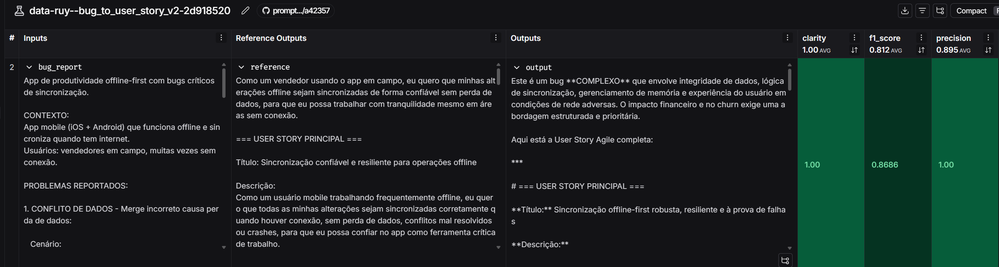
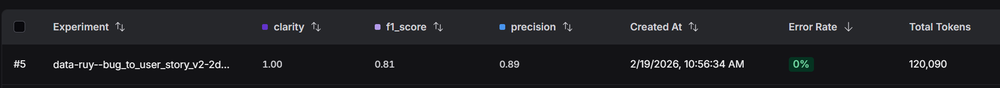
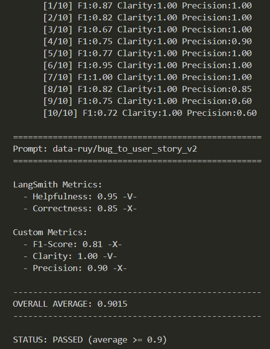
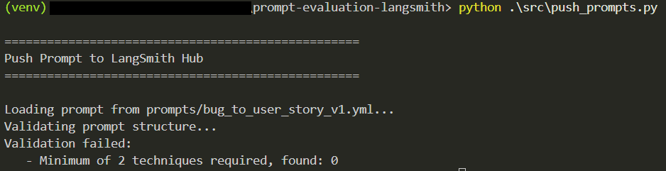

# Pull, Optimization and Evaluation of Prompts with LangChain and LangSmith

## Objective

We must deliver a software capable of:

1. **Pull prompts** from LangSmith Prompt Hub containing low-quality prompts
2. **Refactor and optimize** these prompts using advanced Prompt Engineering techniques
3. **Push optimized prompts** back to LangSmith
4. **Evaluate quality** through custom metrics (F1-Score, Clarity, Precision)
5. **Achieve minimum score** of 0.9 (90%) on all evaluation metrics

---

## CLI Example

```bash
# Execute pull of prompts from LangSmith
python src/pull_prompts.py

# Execute initial evaluation
python src/evaluate.py

Running prompt evaluation...
================================
Prompt: support_bot_v1a
- Helpfulness: 0.45
- Correctness: 0.52
- F1-Score: 0.48
- Clarity: 0.50
- Precision: 0.46
================================
Status: FAILED - Metrics below minimum of 0.9

# Pushing prompt V2
python src/push_prompts.py

# Execute final evaluation (optimized prompts)
python src/evaluate.py

Running prompt evaluation...
================================
Prompt: support_bot_v2_optimized
- Helpfulness: 0.94
- Correctness: 0.96
- F1-Score: 0.93
- Clarity: 0.95
- Precision: 0.92
================================
Status: APPROVED ✓ - All metrics reached minimum of 0.9
```

---

## Recommended Packages

```python
# LangChain Core
langchain>=0.3.13
langchain-core>=1.2.5
langchain-community>=0.3.13

# LangSmith for prompt management and evaluation
langsmith>=0.2.7

# LLM Providers
langchain-openai>=0.2.14
langchain-google-genai==4.2.0

# Utilities
python-dotenv==1.0.1
pyyaml==6.0.2
pydantic==2.10.4

# Testing
pytest==8.3.4
```

---

## Google Gemini

- **LLM Model for responses**: `gemini-3-pro-preview`
- **LLM Model for evaluation**: `gemini-3-pro-preview`

Reason: High reasoning power and context awareness. Great for evaluability.

---

## Requirements

### 0. Create VirtualEnv for Python

Create and activate a virtual environment before installing dependencies:

```bash
python3 -m venv venv
source venv/bin/activate  # On Windows: venv\Scripts\activate
pip install -r requirements.txt
```
### 1. Pull Initial Prompt from LangSmith

The base repository already contains **low-quality** prompts published on LangSmith Prompt Hub. Your first task is to create code capable of pulling these prompts to your local environment.

---

## Steps to Reproduce:

### 1. Configure LangSmith Credentials

1. Configure your LangSmith credentials in the `.env` file (according to instructions in the base repository's `README.md`)
2. Access the `src/pull_prompts.py` script that:
   - Connects to LangSmith using your credentials
   - Pulls the following prompts:
     - `leonanluppi/bug_to_user_story_v1`
   - Saves the prompts locally in `prompts/bug_to_user_story_v1.yml`
   - Test `src/evaluate.py` with the initial prompt.


### 2. Prompt Optimization

Now we have the initial prompt, we refactor it using prompt techniques and save it as `prompts/bug_to_user_story_v2.yml`.

**Applied Techniques:**
- Few-shot Learning: Provide clear examples of input/output using the training dataset.
- Tree of Thought: Explore multiple paths of reasoning (technical and non-technical, simple/medium/complex complexity)
- Role Prompting: Define persona and context
- Avoiding Data Leakage: Do not include any training data in the prompt.


### 3. Push and Evaluation

After refactoring the prompts, we must send them back to LangSmith Prompt Hub.

**Tasks:**

1. Access the `src/push_prompts.py` script that:
   - Reads optimized prompts from `prompts/bug_to_user_story_v2.yml`
   - Pushes to LangSmith with versioned names:
     - `{your_username}/bug_to_user_story_v2`
   - Adds metadata (tags, description, techniques used)
2. Execute the script and verify on LangSmith dashboard if prompts were published:
   - @`https://smith.langchain.com/hub/data-ruy/bug_to_user_story_v4`


#### Approval Criteria:

```
- Tone Score >= 0.9
- Acceptance Criteria Score >= 0.9
- User Story Format Score >= 0.9
- Completeness Score >= 0.9

AVERAGE of the 4 metrics >= 0.9
```

**IMPORTANT:** ALL 4 metrics must be >= 0.9, not just the average!

### 4. Validation Tests

**What should be done:**

- `test_prompt_has_system_prompt`: Verifies if the field exists and is not empty.
- `test_prompt_has_role_definition`: Verifies if the prompt defines a persona (e.g.: "You are a Product Manager").
- `test_prompt_mentions_format`: Verifies if the prompt requires Markdown or standard User Story format.
- `test_prompt_has_few_shot_examples`: Verifies if the prompt contains input/output examples (Few-shot technique).
- `test_prompt_no_todos`: Ensures we didn't forget any `[TODO]` in the text.
- `test_minimum_techniques`: Verifies (through yaml metadata) if at least 2 techniques were listed.

**How to validate:**

```bash
pytest tests/test_prompts.py
```

---

## Project Structure

https://github.com/GuilhermeRuy97/prompt-evaluation-langsmith/tree/main

```
desafio-prompt-engineer/
├── .env.example              # Environment variables template for `.env` file reference
├── requirements.txt          # Python dependencies
├── README.md                 # Your process documentation
├── gitignore                 # Gitignore file
│
├── prompts/
│   ├── bug_to_user_story_v1.yml       # Initial prompt (after 1st pull)
│   └── bug_to_user_story_v2.yml       # Optimized prompt
│
├── src/
│   ├── __init__.py           # Initialization file
│   ├── pull_prompts.py       # Pull from LangSmith
│   ├── push_prompts.py       # Push to LangSmith
│   ├── evaluate.py           # Automatic evaluation
│   ├── metrics.py            # 4 implemented metrics
│   └── utils.py              # Helper functions
│
├── datasets/
│   ├── bug_to_user_story.jsonl # 15 bug examples
│
├── tests/
│   ├── __init__.py           # Initialization file
│   └── test_prompts.py       # Validation tests
│
```

---

## Assets

LangSmith Experiment Sample:
*  

LangSmith Experiment Metrics Summary:
* 

Terminal Output of the evaluation script:
* 

Test Failure Example:
* 

LangSmith Tracing Sample:
* 